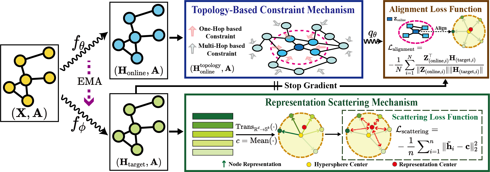

# SGRL_Pytorch
Official PyTorch implementation of SGRL in 'Exploitation of a Latent Mechanism in Graph Contrastive Learning: Representation Scattering' (NeurIPS 2024).

#Hyperparameters for training SGRL:
### Table 4: Detailed hyperparameters of SGRL
| Dataset             | Hidden dim | online learning rate | target learning rate | Training epochs | Activation | momentum |
|---------------------|------------|----------------------|----------------------|-----------------|------------|----------|
| WikiCS              | 1024       | 0.00001             | 0.00001             | 500             | PReLU      | 0.99     |
| Amazon-Computers    | 1024       | 0.001               | 0.001               | 700             | PReLU      | 0.99     |
| Amazon-Photo        | 1024       | 0.001               | 0.001               | 700             | PReLU      | 0.99     |
| Coauthor-CS         | 1024       | 0.001               | 0.001               | 700             | PReLU      | 0.99     |
| Coauthor-Physics    | 1024       | 0.0001              | 0.00001             | 1000            | PReLU      | 0.99     |
